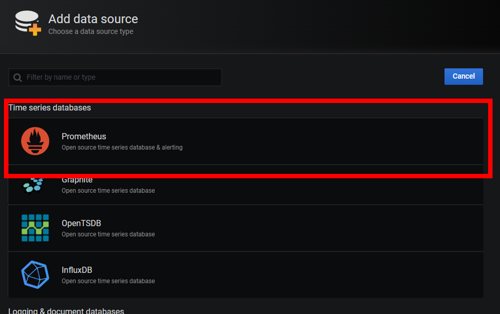

# Spring 서버 Monitoring 구축하기

[1. Spring Boot Actuator 설정](#1-spring-boot-actuator-설정)  
[2. prometheus 설정](#2-prometheus-설정)  
[3. Grafana 연동하기](#3-grafana-연동하기)

---
<br>

spring boot acturator + prometheus + grafana 를 통한 모니터링 시스템 구축

## 1. Spring Boot Actuator 설정
<br>

Spring Actuator란 Spring Boot에서 제공하는 여러가지 정보를 모니터링 하기 쉽게 정리해주는 기능.

각 인스턴스에 대한 CPU, Menory, GC, Heap 등을 종합적으로 정리해서 제공한다.


### 1.1  Actuator 와 prometheus를 ```build.gradle```에 추가

```xml
// actuator
implementation 'org.springframework.boot:spring-boot-starter-actuator'

// prometheus
implementation 'io.micrometer:micrometer-registry-prometheus'
```


### 1.2 aplication.properties 혹은 yml에 protery 추가


* 기본적으로 ```/health``` 와 ```/info``` 2가지 endpoint만 deafult로 사용 가능하나 
```/prometheus``` 를 사용할 수 있게 추가한다.

```
management.endpoints.jmx.exposure.include=health, info, prometheus, metrics
management.endpoints.web.exposure.include=health, info, prometheus, metrics
management.endpoints.web.exposure.exclude=
management.endpoint.health.show-details=always
management.endpoints.web.base-path=/actuator
management.endpoint.prometheus.enabled=true
```
* Actuator 기본 path는 /actuator 

### 1.3 SecurityConfiguration에 접근 허용

* Spring Security를 사용하는 경우 actuator path 접근 허용 추가
```java
.antMatchers("/actuator/**").permitAll()
```
### 1.4 Spring Acturator EndPoint 예시
<br>


### 참조
- 자세한 Spring Actuator에 대한 정리  
[Spring Actuator EndPoint](https://incheol-jung.gitbook.io/docs/study/srping-in-action-5th/chap-16.)
---

## 2. prometheus 설정

프로메테우스는 매트릭 기반의 오픈소스 모니터링 시스템 Pull 기반의 데이터 수집 방법을 제공한다.

Spring Actuator에서 제공하는 promethues 정보를 수집한다.

즉, Spring Boot API 서버에서 모니터링 데이터를 제공하면 프로메테우스는 Http 통신을 이용하여 데이터를 수집.

### 2.1 프로메테우스의 기본 아키텍처

- 프로메테우스 서버
- 스크랩대상
- 미리 설정된 규칙에 따라 경고를 발생시키는 Alert Manager 
  
  

 - 프로메테우스는 여러 유용한 매트릭을 스크랩하여 어플리켜이션에서 발생하는 상황을 시각적으로 이해가 쉽게 여러 차트를 생성가능하다.
 - 다만, 이 시각화 도구가 다소 어려워 시각화 기능을 보강하기 위한 도구를 사용한다. (그라파나, 키바나 등등)

    

### 2.2 centos7 prometheus 설치

CentOS7 Install 
```shell
wget https://github.com/prometheus/prometheus/releases/download/v2.17.1/prometheus-2.17.1.linux-amd64.tar.gz
tar -xzf prometheus-2.17.1.linux-amd64.tar.gz
cd prometheus-2.17.1.linux-amd64
```

```shell
# 시스템 서비스 등록
vi /etc/systemd/system/prometheus.service

[Unit]
Description=Prometheus Time Series Collection and Processing Server
Wants=network-online.target
After=network-online.target

[Service]
User=prometheus
Group=prometheus
Type=simple
ExecStart=/usr/local/bin/prometheus \
    --config.file /etc/prometheus/prometheus.yml \
    --storage.tsdb.path /var/lib/prometheus/ \
    --web.console.templates=/etc/prometheus/consoles \
    --web.console.libraries=/etc/prometheus/console_libraries

[Install]
WantedBy=multi-user.target
```

프로메테우스 서버 실행
```shell
$ systemctl start prometheus
```
정상 실행 화면


### 2.3 프로메테우스에서 Spring Actuator 정보 수집

- 압축해제 후 폴더 안의 `prometheus.yml` 구성 파일을 수정하여 사용
- 프로메테우스는 기본적으로 `9090` 포트를 사용

- prometheus.yml 파일에서 정보를 수집할 Target Server를 세팅
- 하단에 job_name: 'spring-actuator' 정보를 추가.

  ```yaml
  # A scrape configuration containing exactly one endpoint to scrape:
  # Here it's Prometheus itself.
  scrape_configs:
    # The job name is added as a label `job=<job_name>` to any timeseries scraped from this config.
    - job_name: "prometheus"

      # metrics_path defaults to '/metrics'
      # scheme defaults to 'http'.

      static_configs:
        - targets: ["localhost:9090"]
    
    # 정보를 수집할 서버 정보(http통신이 기본)
    - job_name: 'spring-actuator'
      metrics_path: '/actuator/prometheus'
      scrape_interval: 5s
      static_configs:
      - targets: ['localhost:8080']
    
  ```

- Status -> Target 선택 

  

- Spring Actuator Target Server의 정보를 확인 가능
- Status 값으로 Application이 현재 기동중인지 확인이 가능.

  

#### **global**
Prometheus의 전반적인 설정을 관리
- scrape_interval : 스크랩 주기를 설정
- evaluation_interval  시계열 생성 및 알람주기 설정

#### **rule_files**
Prometheus 에서 불러올 rules 파일에 대한 경로를 설정

#### **scrape_configs**
Prometheus에서 어떤 자원은 모니터링 할지 설정한다.

### 2.4 PromQL 참고자료

- PromQL을 사용하여 다양한 데이터를 바탕으로 모니터링 가능  

[PromQL 기본](https://devthomas.tistory.com/15)  
[유용한 PromQL](https://taemy-sw.tistory.com/26)  

---

## 3. Grafana 연동하기

매트릭 데이터를 시각화 할 때 가장 널리 사용되는 도구 중 하나
그라파나는 엘라스틱 서치, 인플럭스 DB 등 다양한 데이터 소스를 시각화 할 수 있다.

### 3-1. Grafana 설치하기

```sh
$ yum install grafana
```

* 기본 포트는 3000번 `localhost:3000`으로 접속하여 확인


### 3-2. 구성 방법

- 로그인 후 해당 페이지에서 `Create a data source` 선택


- prometheus 선택


- prometheus 서버 정보 입력 후 `Save & Test` 선택


- build a dashboard 선택
 

- Add Query 에서 PromQL을 사용하여 데이터를 조회하여 시각화 가능
  

### 3-3.간편하게 대시보드를 구성하는법

Spring, MySQL 등 자주 사용하는 구성은 [여기](https://grafana.com/grafana/dashboards/)에서 확인 가능하다.

JSON 혹은 clipboard ID를 사용하여 다른사람들이 구성한 대시보드를 가져와서 사용하면 편리하다.

- 실제 사용예
  
  


---

## Reference 

- https://velog.io/@moey920/안정적인-운영을-완성하는-모니터링.-프로메테우스와-그라파나
- https://danawalab.github.io/common/2020/03/17/Common-Dashboard.html
- https://skagh.tistory.com/40
- https://docs.spring.io/spring-boot/docs/current/reference/html/actuator.html#actuator.endpoints